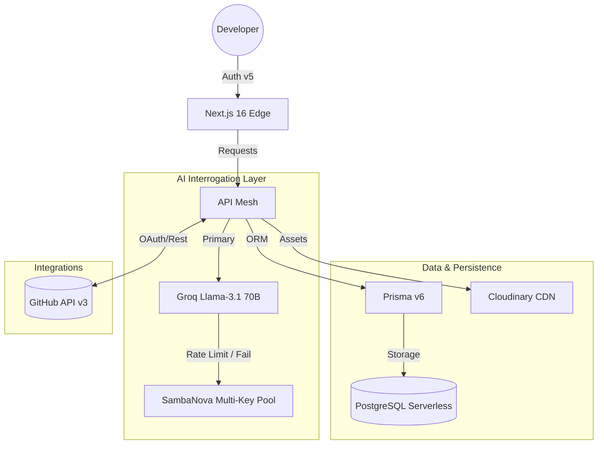

<div align="center">
  
  <h1>DevRoast AI</h1>
  <p><strong>The High-Stakes Interrogation Terminal for Modern Developers</strong></p>

  [](https://dev-roast-ai-sand.vercel.app)
  [](https://nextjs.org/)
  [](https://www.prisma.io/)
  [](https://www.sambanova.ai/)
</div>

---

## 🌪️ Overview
**DevRoast AI** is a premium, high-tech ecosystem designed to audit and roast your technical history. Built on a foundation of **"Cyber-Industrial"** aesthetics, it transforms standard GitHub analytics into an aggressive, AI-powered interrogation experience.

> *"Your code isn't just bad; it's a liability. We're here to help you fix it."*

---

## 🏗️ Technical Architecture

DevRoast AI operates on a **Non-Blocking Distributed AI Architecture**. By leveraging a multi-key rotation strategy across two distinct LLM providers, we ensure zero downtime and maximum throughput.



---

## 🖥️ The Interrogation Experience (V3.0)

Our signature UI, the **"Interrogation Terminal"**, provides a real-time, step-by-step audit of your code. As seen in our latest V3 logic, the terminal performs a deep architectural scan:

1.  **Connecting to GitHub API**: Establishes a secure, authenticated tunnel to your profile data.
2.  **Target Locking**: Localizes the specific repository or username for audit.
3.  **Metadata Extraction**: Gathers commit patterns, file structures, and dependency graphs.
4.  **Architectural Critique**: Scans for "Fix" commit concentrations, prop-drilling depth, and technical debt.
5.  **Fatal Diagnosis**: Generates a brutal score and actionable steps to "Repair Dignity."

---

## 🧠 Core Intelligence: Hybrid Key Rotation

To provide a seamless experience without API exhaustion errors, DevRoast AI implements a **Recursive Multi-Key Strategy**:

- **Groq Layer**: Attempts to fulfill requests using a pool of rotating API keys (`GROQ_API_KEYS`).
- **SambaNova Fallback**: If all Groq keys are exhausted or hit rate limits, the system automatically pivots to the SambaNova pool.
- **JSON Guard**: A custom formatting layer ensures that even if the LLM hallucinates markdown, our `parseAIJson` utility extracts valid data structures.

---

## 📂 Data Model (Entity Relationship)

DevRoast AI maintains a complex schema via **Prisma** to persist your interrogation history and achievements:

- **User**: Core profile with `github_username` and linked OAuth accounts.
- **Analysis**: Persistent records of your roasts, including `score`, `target`, and `result_json`.
- **UserBadge**: Gamification tokens earned through specific GitHub behaviors.
- **LibraryAsset**: Generated portfolios, resumes, and audited assets stored globally.
- **Chat**: History of your sessions with the Neural AI Mentor.

---

## 📡 API Reference

### Profile Interrogation
`GET /api/analyze/github-profile?username={username}`
- **Response**:
    ```json
    {
      "total_repos": 42,
      "total_stars": 120,
      "top_languages": ["TypeScript", "Rust"],
      "account_age_days": 1200,
      "repositories_missing_description": 5
    }
    ```

### AI Roast Generation
`POST /api/analyze/engine-profile`
- **Payload**: `{ "username": "...", "metrics": { ... } }`
- **Response**:
    ```json
    {
      "score": 2.4,
      "roastLines": ["Prop drilling depth exceeded 15 levels. Stop it."],
      "suggestions": ["Normalize your state", "Adopt React Query"],
      "isSaved": true
    }
    ```

---

## 🎨 Branding Suite & Visual Identity

DevRoast AI features a **Cyber-Brutalism** design system using **Tailwind CSS 4** and **Framer Motion**.

- **Primary Variant**: *Cyber Octocat* — A 3D glass silhouette.
- **Sub-Brand: Git-Coin**: Symbolic of technical value.
- **Sub-Brand: Code Phoenix**: Representing growth through roast-based feedback.
- **Sub-Brand: Thermal Git-Web**: Visualizing complex repository dependencies.

---

## 🛠️ Local Development & Deployment

### 1. Requirements
- Node.js 20+
- PostgreSQL (Neon.tech recommended)
- GitHub OAuth App Credentials

### 2. Setup
```bash
git clone https://github.com/Ashwinjauhary/DevRoast-Ai.git
npm install
npx prisma db push
```

### 3. Vercel Deployment
Ensure `AUTH_URL` matches your production domain. The build script automatically handles `prisma generate` to prevent client-server mismatches in the Vercel build environment.

---

## 🗺️ Future Roadmap
- [ ] **Roast as a Service (RaaS)**: Embeddable widgets for your personal sites.
- [ ] **VS Code Extension**: Real-time terminal roasts as you write code.
- [ ] **Team Sentiment Analysis**: Auditing team collaboration health.

---

<div align="center">
  <p>Engineered with 🔥 by <a href="https://github.com/Ashwinjauhary">Ashwin Jauhary</a></p>
  <p><strong>DevRoast AI © 2026</strong></p>
</div>
