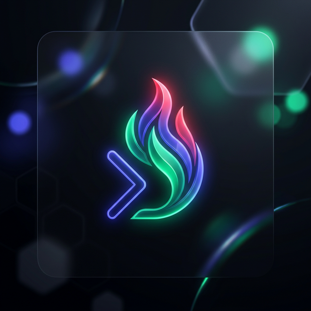
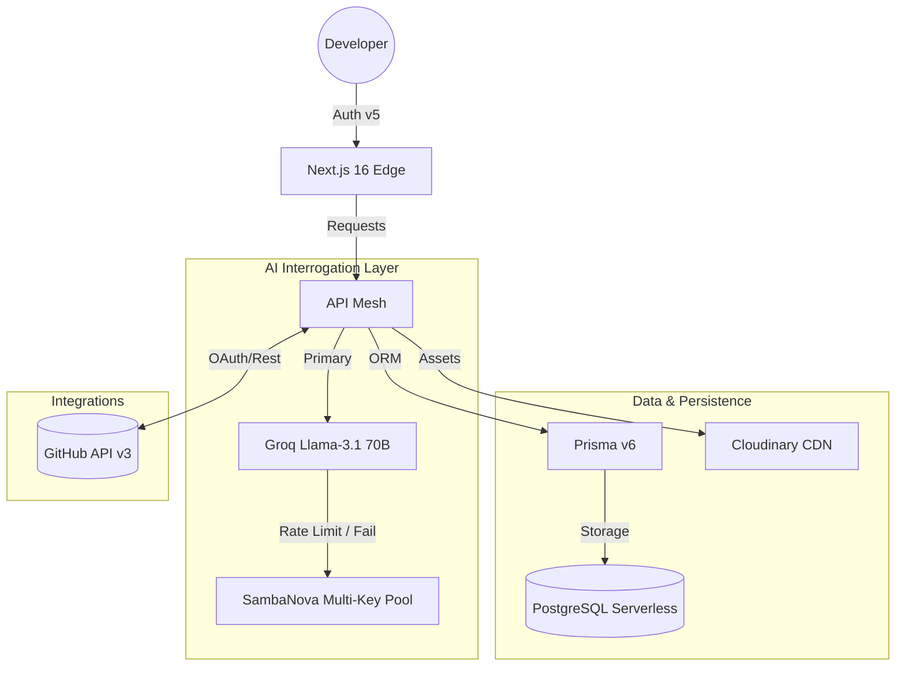

<div align="center">
  
  <h1>DevRoast AI</h1>
  <p><strong>The High-Stakes Interrogation Terminal for Modern Developers</strong></p>

  [](https://dev-roast-ai-sand.vercel.app)
  [](https://nextjs.org/)
  [](https://react.dev/)
  [](https://tailwindcss.com/)
  [](https://www.prisma.io/)
  [](https://www.sambanova.ai/)
</div>

---

## 🌪️ Overview
**DevRoast AI** is a premium, high-tech ecosystem designed to audit and roast your technical history. Built on a foundation of **"Cyber-Industrial"** aesthetics, it transforms standard GitHub analytics into an aggressive, AI-powered interrogation experience. 

Whether you're looking to generate a 10/10 AI portfolio, fix technical debt in your repos, or get a brutal critique of your resume DNA, DevRoast AI is your central terminal for professional technical evolution.

> *"Your code isn't just bad; it's a liability. We're here to help you fix it."*

---

## 🕹️ The Dashboard Modules (V3.0)

DevRoast AI is composed of specialized neural modules, each targeting a specific pillar of your developer identity.

### 🏛️ Neural Portfolio Architect
Automatically synthesize your GitHub history into a stunning, interactive portfolio. 
- **Full Customization**: Toggle between "Brutalist", "Modern", and "Executive" themes.
- **Dynamic Projects**: Showcases your most impactful work with AI-generated impact summaries.
- **Vibe Integration**: Includes AI-crafted "vibes" and "roasts" to make your profile stand out.

### 🔎 Global Repo Interrogator
A centralized command center to manage, improve, and audit your GitHub repositories.
- **Premium Actions**: Enhance descriptions and generate professional READMEs with one click.
- **Auto-Fix Codebase**: AI scans your code and creates targeted issues for architectural flaws.
- **Native Operations**: Create, edit, and delete repositories directly from the terminal.

### 📄 Resume DNA Synthesizer
Generate the top 1% of elite, ATS-friendly LaTeX resumes.
- **Neural Synthesis**: Your GitHub data is processed to extract your actual "Technical DNA".
- **Real-time Preview**: Edit the raw LaTeX code or view the high-impact PDF preview instantly.
- **Targeted Roles**: Prompt the AI to focus on specific roles like "Senior Backend" or "Platform Engineer".

### ⚖️ AI Code Review (Master Mode)
Paste any snippet and let the AI tear it apart.
- **The Roast**: Direct, brutal feedback on your coding style and choices.
- **Defect Detection**: Identifies critical security flaws and performance leaks.
- **Corrected Source**: Provides an optimized, professional version of your code.

### 🔋 Additional Tools
- **Stack Recommender**: Validates your project goals against your chosen tech choices.
- **Interview Prep**: Generates personalized, high-stakes questions based on your identified weaknesses.
- **Job Match Engine**: Compares your technical history against any Job Description to identify gaps.

---

## 🏗️ Technical Architecture

DevRoast AI operates on a **Non-Blocking Distributed AI Architecture**. By leveraging a multi-key rotation strategy across two distinct LLM providers, we ensure zero downtime and maximum throughput.



---

## 🧠 Core Intelligence: Hybrid Key Rotation

To provide a seamless experience without API exhaustion errors, DevRoast AI implements a **Recursive Multi-Key Strategy**:

- **Groq Layer**: Attempts to fulfill requests using a pool of rotating API keys (`GROQ_API_KEYS`).
- **SambaNova Fallback**: If all Groq keys are exhausted or hit rate limits, the system automatically pivots to the SambaNova pool.
- **JSON Guard**: A custom formatting layer ensures that even if the LLM hallucinates markdown, our `parseAIJson` utility extracts valid data structures.
- **Global Toasts**: All interactions are backed by a premium global notification system using `react-hot-toast`.

---

## 📂 Data Model (Entity Relationship)

DevRoast AI maintains a complex schema via **Prisma** to persist your interrogation history and achievements:

| Entity | Purpose | Key Fields |
| :--- | :--- | :--- |
| **User** | Core Profile | `github_username`, `email`, `role` |
| **Analysis** | Record of Roasts | `score`, `target`, `result_json` |
| **UserBadge** | Gamification Units | `label`, `type`, `description` |
| **LibraryAsset** | Generated Outputs | `url`, `type (PDF/JSON)`, `owner` |
| **Chat** | AI Mentor Context | `session_id`, `messages`, `context` |

---

## 📡 API Reference

### Profile Interrogation
`GET /api/analyze/github-profile?username={username}`
- **Usage**: Gathers core metrics for interrogation.
- **Response**:
    ```json
    {
      "total_repos": 42,
      "total_stars": 120,
      "top_languages": ["TypeScript", "Rust"],
      "account_age_days": 1200
    }
    ```

### Expert Code Review
`POST /api/review/code`
- **Usage**: Submits a code block for AI auditing.
- **Payload**: `{ "code": "...", "language": "TypeScript" }`
- **Return Stream**: `[ROAST_START]...[ROAST_END][ISSUES_START]...[ISSUES_END][FIX_START]...[FIX_END]`

---

## 🎨 Branding Suite & Visual Identity

DevRoast AI features a **Cyber-Brutalism** design system using **Tailwind CSS 4** and **Framer Motion**.

- **Primary Variant**: *Cyber Octocat* — A 3D glass silhouette.
- **Standard Palette**: Saffron-Black, Emerald-Neon, and Industrial Zinc.
- **Typography**: Inter for readability, Space Mono for terminal-like precision.

---

## 🛠️ Local Development & Deployment

### 1. Requirements
- Node.js 20+
- PostgreSQL (Neon.tech recommended)
- GitHub OAuth App Credentials
- Groq / SambaNova API Keys

### 2. Setup
```bash
# Clone the repository
git clone https://github.com/Ashwinjauhary/DevRoast-Ai.git

# Install dependencies
npm install

# Force sync database schema
npx prisma db push

# Launch development terminal
npm run dev
```

### 3. Environment Configuration
Create a `.env` file with the following keys:
- `DATABASE_URL`: Your Neon PostgreSQL connection string.
- `AUTH_SECRET`: Random 32-char string.
- `AUTH_GITHUB_ID` / `AUTH_GITHUB_SECRET`: From your GitHub App.
- `GROQ_API_KEYS`: Comma-separated list for rotation.
- `SAMBANOVA_API_KEY`: Fallback engine access.

---

## 🗺️ Future Roadmap
- [ ] **Roast as a Service (RaaS)**: Embeddable widgets for your personal sites.
- [ ] **VS Code Extension**: Real-time terminal roasts as you write code.
- [ ] **Team Sentiment Analysis**: Auditing team collaboration health.
- [ ] **Mobile App Expansion**: DevRoast on the go (React Native).

---

<div align="center">
  <p>Engineered with 🔥 by <a href="https://github.com/Ashwinjauhary">Ashwin Jauhary</a></p>
  <p><strong>DevRoast AI © 2026</strong></p>
</div>
