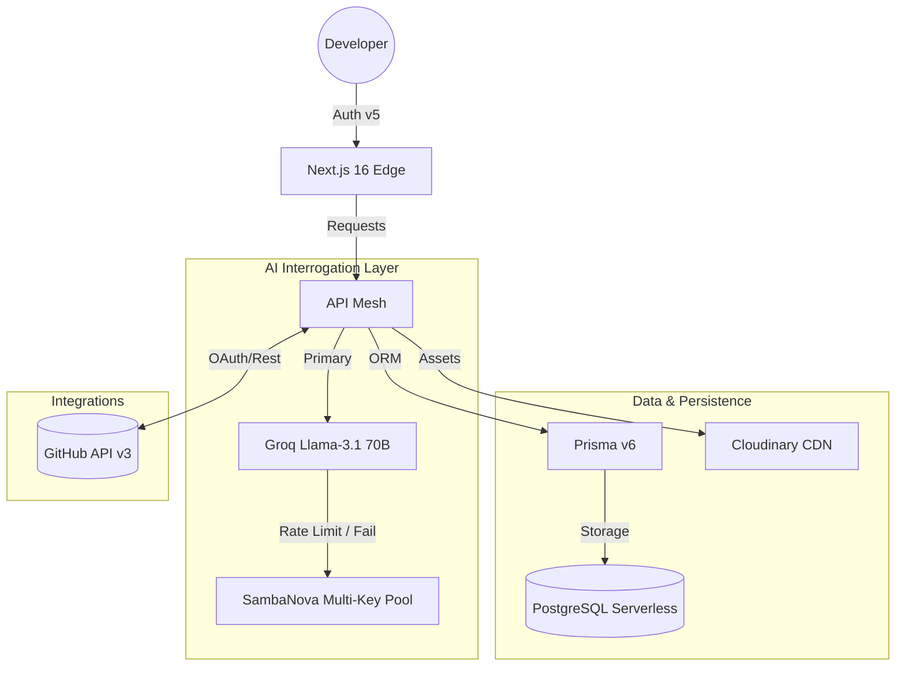

<div align="center">
  
  <h1>DevRoast AI</h1>
  <p><strong>The High-Stakes Interrogation Terminal for Modern Developers</strong></p>

  [](https://dev-roast-ai-sand.vercel.app)
  [](https://nextjs.org/)
  [](https://react.dev/)
  [](https://tailwindcss.com/)
  [](https://www.prisma.io/)
  [](https://www.sambanova.ai/)
</div>

---

## 🌪️ Overview
**DevRoast AI** is a premium, high-tech ecosystem designed to audit and roast your technical history. Built on a foundation of **"Cyber-Industrial"** aesthetics, it transforms standard GitHub analytics into an aggressive, AI-powered interrogation experience.

> *"Your code isn't just bad; it's a liability. We're here to help you fix it."*

---

## 🕹️ The Full Neural Ecosystem (V3.0)

DevRoast AI is structured into specialized command sectors, each targeting a critical aspect of the developer lifecycle.

### 🏛️ 1. Overview & Identity
The entry point to your technical soul.
- **Unified Dashboard**: Real-time visualization of your GitHub standing.
- **Developer Profile**: A premium, public-facing identity card showcasing your AI-audited stats.

### 🚀 2. MVP Feature Suite
The core tools that define the "Roast" experience.
- **GitHub Analysis**: High-stakes audit of your entire account history.
- **Repo Analysis**: Deep architectural interrogation of individual codebases.
- **AI Portfolio Architect**: Automated synthesis of your work into a 10/10 portfolio.
- **Resume DNA Synthesizer**: Generates elite LaTeX resumes by analyzing your technical contributions.
- **Code Review Bot**: A brutal, real-time feedback engine for code snippets.

### ⚡ 3. Core Engagement & Gamification
- **Repositories**: Native command center for managing GitHub projects.
- **Dev Duels**: Compare technical metrics against global peers (Experimental).
- **Achievements**: Unlock industrial-grade badges based on coding habits.
- **Advanced Analysis**: Multi-dimensional scoring for complex architectures.

### 📊 4. Org Dashboard & Intel
High-level telemetry for professional tracking.
- **Developer Score**: A proprietary neural score (1-10) of your technical value.
- **Global Leaderboard**: See where you stand in the hierarchy of modern developers.
- **Score History**: Temporal tracking of your technical evolution.
- **Language Map**: Geospatial-style visualization of your technology stack.

### 🤖 5. AI Developer Suite
Force-multipliers for your daily workflow.
- **AI Mentor Chat**: Real-time consultation with our neural architecture expert.
- **README Generator**: Automates elite documentation for your projects.
- **Commit Auditor**: Scans commit history for quality and security leaks.
- **Diff Explainer**: Simplifies complex changes into actionable intelligence.
- **Branch Namer**: Generates perfectly semantic branch names for any feature.
- **Stack Recommender**: Validates project goals against modern tech stacks.

### 📈 6. Career & Growth Engine
- **Job Match Engine**: Analyzes your data against JDs to identify technical gaps.
- **Interview Prep**: Generates high-stakes questions based on your specific weaknesses.
- **OSS Recommender**: Targets Open Source projects perfectly aligned with your DNA.

### 🛡️ 7. Security & Quality Control
- **License Checker**: Ensures your repos follow industrial legal standards.
- **Dependency Monitor**: Scans for liability in your package ecosystem.

### 📚 8. System & Library
- **Neural Library**: Persistent storage for all your AI-generated assets (PDFs, Portfolios).
- **History**: Full audit log of every interrogation session.
- **Account Settings**: Management of your GitHub Auth and identity.

---

## 🏗️ Technical Architecture

DevRoast AI operates on a **Non-Blocking Distributed AI Architecture**.



---

## 🛠️ Installation & Setup

```bash
# Clone and Install
git clone https://github.com/Ashwinjauhary/DevRoast-Ai.git
cd devroast-ai
npm install

# Database Synchronization
npx prisma db push

# Launch Terminal
npm run dev
```

### Required Environment Variables
| Key | Purpose |
| :--- | :--- |
| `DATABASE_URL` | Neon.tech PostgreSQL connection |
| `AUTH_GITHUB_ID` | GitHub OAuth Client ID |
| `GROQ_API_KEYS` | Comma-separated rotation pool |
| `SAMBANOVA_API_KEY` | Secondary intelligence fallback |

---

<div align="center">
  <p>Engineered with 🔥 by <a href="https://github.com/Ashwinjauhary">Ashwin Jauhary</a></p>
  <p><strong>DevRoast AI © 2026</strong></p>
</div>
